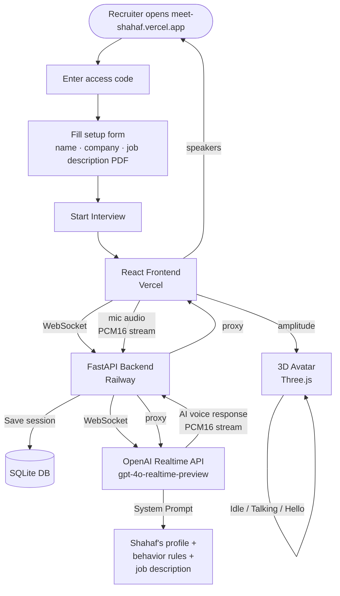

# Meet Shahaf 🎙️

An AI voice agent with a 3D avatar that represents me in recruiter conversations — available 24/7, no scheduling needed.

Recruiters visit the link, see my 3D avatar, and have a real voice conversation with an AI that answers as if it were me.

---

## Architecture

---

## How It Works

A recruiter opens the link, enters an access code, and fills in their name and company. They can optionally upload a job description PDF. Once the call starts, they speak naturally — the AI responds in real time as Shahaf.

The entire audio pipeline is a single continuous stream — no separate speech-to-text or text-to-speech steps.

---

## Tech Stack

| Layer | Technology |
|-------|------------|
| Frontend | React 18, Three.js, @react-three/fiber |
| 3D Avatar | GLB model with embedded animations |
| Backend | Python, FastAPI, WebSockets |
| AI | OpenAI Realtime API (`gpt-4o-realtime-preview`) |
| Deploy | Vercel (frontend) · Railway (backend) |

---

## Live

[meet-shahaf.vercel.app](https://meet-shahaf.vercel.app)
