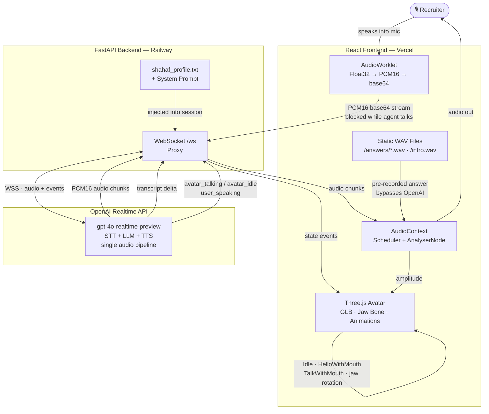

# Meet Shahaf 🎙️

An AI voice agent with a 3D avatar that represents me in recruiter conversations — available 24/7, no scheduling needed.

Recruiters visit the link, enter an access code, and have a real-time voice conversation with an AI that answers as Shahaf.

---

## Architecture

---

## How It Works

**Three separate flows run in parallel:**

**1 — Real-time voice conversation**
The recruiter speaks → `AudioWorklet` converts to PCM16 and streams base64 frames over WebSocket → FastAPI proxies to OpenAI Realtime → OpenAI returns PCM16 audio chunks + transcript deltas → audio plays through `AudioContext`, jaw bone animates from `AnalyserNode` amplitude.

**2 — Static pre-recorded answers**
Clicking a suggested question fetches a pre-recorded WAV (generated offline with OpenAI TTS), plays it through the same `AudioContext → AnalyserNode` chain, and sends `stop_agent` to cancel any in-flight OpenAI response. The mic is blocked during playback to prevent echo feedback.

**3 — Intro sequence**
On call start, `intro.wav` plays via an HTML `<Audio>` element while the avatar transitions to `HelloWithMouth` animation. The WebSocket opens only after the intro finishes.

---

## Tech Stack

| Layer | Technology |
|-------|------------|
| Frontend | React 18, Three.js, @react-three/fiber, @react-three/drei |
| Audio | Web Audio API — AudioWorklet, AudioContext, AnalyserNode |
| 3D Avatar | GLB (Avaturn) · jaw bone animation · HelloWithMouth / TalkWithMouth / Idle |
| Backend | Python, FastAPI, WebSockets |
| AI | OpenAI Realtime API (`gpt-4o-realtime-preview`) — STT + LLM + TTS in one pipeline |
| Deploy | Vercel (frontend) · Railway (backend) |

---

## Key Engineering Challenges

- **PCM16 pipeline** — Browser produces Float32; `AudioWorklet` converts to Int16 → base64 on a separate thread without blocking the UI
- **Echo prevention** — `isAgentTalking` flag blocks mic transmission while agent audio is playing, preventing feedback loops
- **Gapless audio** — `nextPlayTime` scheduler queues incoming PCM16 chunks back-to-back with zero gaps
- **Jaw animation** — `useFrame` at priority `-1` runs after the animation mixer; reads `AnalyserNode` amplitude and applies rotation to the `Head.003` bone
- **Static answer system** — Pre-recorded WAVs eliminate per-question API latency and cost; playback routes through the same analyser so jaw animation works identically

---

## Live

[meet-shahaf.vercel.app](https://meet-shahaf.vercel.app) · access code: `meet2026`
